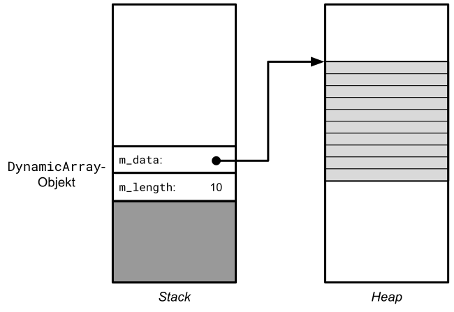
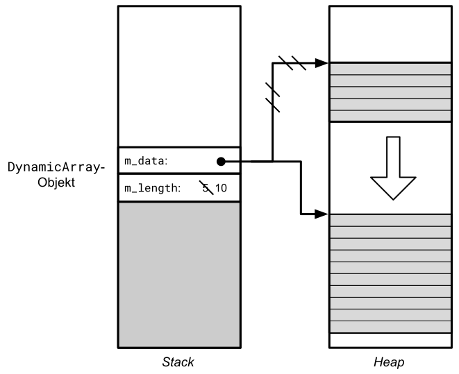
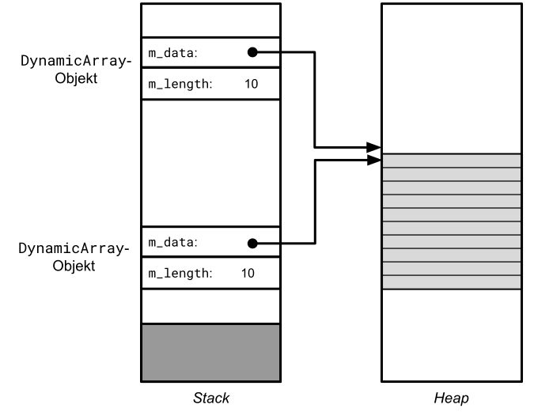
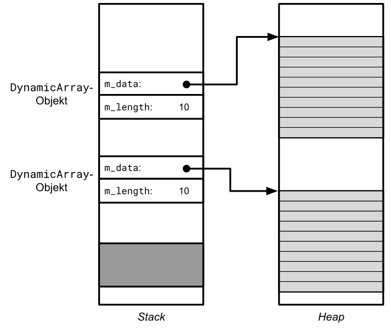

# Aufgabe zu dynamischen Daten: Klasse `DynamicArray`

[Zurück](./Exercises.md)

---

## Übersicht

Folgende C++&ndash;Sprachmittel sollen zum Einsatz kommen:
  * Umgang mit den Operatoren `new` und `delete`
  * Realisierung einer Klasse mit dynamischen Daten
  * Handhabung der Regel *Rule-of-Three*

## Beschreibung

Der Datentyp *Array* steht in C++ für Felder fester Länge.
Es gibt keinerlei Möglichkeit, nach dem Erzeugen eines Felds seine Länge zu ändern.

```cpp
int numbers[10];
```

Der Wert 10 muss zur Übersetzungszeit bekannt sein.

An dieser Stelle kommt die dynamische Speicherverwaltung ins Spiel:
Mit Hilfe der beiden Operatoren `new` und `delete` kann man eine Klasse `DynamicArray` realisieren,
die im Prinzip dieselbe Funktionalität wie C++-Felder besitzt,
nur mit dem Unterschied, dass die Längenangabe sowohl zum Erzeugungszeitpunkt
als auch während der Lebenszeit eines `DynamicArray`-Objekts änderbar ist.

Diese Flexibilität wird erreicht, indem die Daten des Felds in einem Speicherbereich auf der Halde (*Heap*) abgelegt werden.
Bei Bedarf, zum Beispiel, wenn der Datenbereich zu klein geworden ist, kann man auf der Halde ein größeres Stück Speicher reservieren.

Implementieren Sie eine Klasse `DynamicArray`, die diese Eigenschaft besitzt.
Ein Objekt dieser Klasse sollte wie in *Abbildung* 1 gezeigt aussehen:



*Abbildung* 1. Instanzdatenbereich eines `DynamicArray`-Objekts mit dynamisch allokiertem Datenpuffer.

Wir erkennen in *Abbildung* 1 zwei Instanzvariablen in der Klasse `DynamicArray`: `m_data` und `m_length`.
`m_data` enthält die Adresse eines Stück Speichers, das sich auf der Halde befindet und mit dem `new`-Operator angelegt wurde.
Die Länge dieses Speicherbereichs wird in der zweiten Instanzvariablen `m_length` festgehalten.

Die Problematik, wenn der dynamisch allokierte Datenpuffer zu klein wird, haben wir bereits angesprochen.
*Abbildung* 2 soll veranschaulichen, wie wir mit einem größeren Datenpuffer größere Anforderungen erfüllen können.
Neben einem größeren Stück Speicher, das wieder mit dem `new`-Operator angelegt wird, ist zu beachten, dass der
vorhandene Inhalt des alten Speicherbereichs in den neuen umzukopieren ist.



*Abbildung* 2. Vergrößerung des Instanzdatenbereich eines `DynamicArray`-Objekts.


In *Abbildung* 3 und *Abbildung* 4 sprechen wir ein letztes Problem in der Realisierung der `DynamicArray`-Klasse an:
Die Wertzuweisung zweier `DynamicArray`-Objekte. In einem ersten Ansatz könnte man geneigt sein zu denken,
dass diese einfach mit dem Kopieren der beteiligten Instanzvariablen umzusetzen ist.
*Abbildung* 3 versucht darzustellen, dass dies nicht zu einer Realisierung führt, die man als korrekt ansehen kann:
Die beiden in *Abbildung* 3 dargestellten `DynamicArray`-Objekt haben einen gemeinsamen Datenbereich auf Grund des kopierten Zeigers.
Dies ist nicht das, was man sich unter einer echte Kopie vorstellt.



*Abbildung* 3. Falscher Ansatz beim Kopieren eines `DynamicArray`-Objekts.

*Abbildung* 4 veranschaulicht, wie hier korrekt vorzugehen ist: Eine Kopie eines `DynamicArray`-Objekts muss einen neuen, separaten
Datenbereich erhalten:



*Abbildung* 4. Korrekter Ansatz beim Kopieren eines `DynamicArray`-Objekts.


Eine mögliche Schnittstelle der Klasse `DynamicArray` könnte so aussehen:

| Element        | Schnittstelle und Beschreibung |
|:-------------- |-----------------------------------------|
| Standard-Konstruktor | `DynamicArray();`<br/>Belegt die Instanzvariablen mit datentypspezifischen Null-Werten. |
| Benutzerdefinierter Konstruktor | `DynamicArray(size_t size);`<br/>Initialisiert ein `DynamicArray`-Objekt mit einem Datenpuffer der Länge `size` an. |
| *getter* `size()`  | `size_t size() const;`<br/>Liefert die aktuelle Länge des Datenpuffers zurück. |
| `at`     | `int& at (size_t i);`<br/> Zugriff auf ein Element an der Stelle *i*. Bei ungültigem Index wird eine Ausnahme geworfen. |
| Operator `[]` | `int& operator[] (size_t i);`<br/>Wie Methode `at`, nur ohne Gültigkeitsüberprüfung des Index. |
| `fill` | `void fill(int value);`<br/>Belegt alle Elemente des Datenpuffers mit dem Wert `value`. |
| `resize` | `void resize(size_t newSize);`<br/>Ändert die Länge des internen Datenpuffers. Die vorhandenen Daten im Puffer sollen dabei &ndash; soweit möglich &ndash; erhalten bleiben, sprich: Ist die neue Länge kürzer im Vergleich zur aktuellen Länge, spielen die Daten im oberen Teil des alten Puffers keine Rolle mehr. Ist die neue Länge größer, ist der aktuelle Puffer komplett umzukopieren und die zusätzlichen Elemente im oberen Bereich sind mit `0` vorzubelegen. |
| `release` | `void release();`<br/>Gibt den dynamisch allokierten Speicher frei. |
| `print` | `void print();`<br/>Gibt alle Elemente des Datenpuffers in der Konsole aus. |
| `bool operator==` | `friend bool operator== (const DynamicArray& left, DynamicArray right);`<br/>Vergleicht zwei `DynamicArray`-Objekte auf Gleichheit. |
| `bool operator!=` | `friend bool operator!= (const DynamicArray& left, DynamicArray right);`<br/>Vergleicht zwei `DynamicArray`-Objekte auf Ungleichheit. |

*Tabelle* 1: Schnittstelle der Klasse `DynamicArray`.

Beachten Sie, dass neben den in *Tabelle* 1 aufgeführten Methoden
auch noch das Regelwerk der &ldquo;Rule of Three&rdquo; vorhanden ist.

---

## Quellcode der Lösungen:

[*DynamicArray.h*](./DynamicArray/DynamicArray.h)<br />
[*DynamicArray.cpp*](./DynamicArray/DynamicArray.cpp)<br />
[*DynamicArray_Main.cpp*](./DynamicArray/DynamicArray_Main.cpp)<br />

---

[Zurück](./Exercises.md)

---
