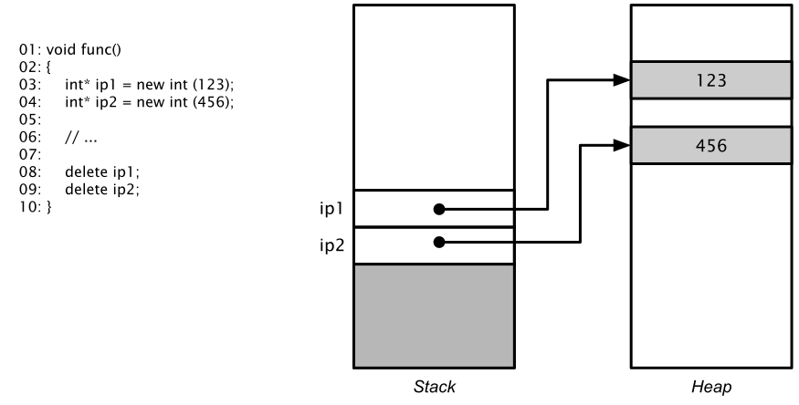

# Dynamische Speicherverwaltung

[Zurück](Agenda.md)

---

## Erläuterungen

### Stack und Heap (Stapel und Halde)

Lokale Variablen haben die Eigenschaft, dass sie nicht dauerhaft verfügbar sind.
Kehrt eine Funktion zurück, werden ihre lokalen Variablen verworfen.
So gesehen eignen sich lokale Variablen zum Beispiel zur Ablage von Zwischenergebnissen.

<p align="center">

</p>

*Abbildung* 1: Der Stack und lokale Variablen.

Der Vorteil von Variablen, die sich auf dem Heap befinden, liegt darin,
daß der reservierte Speicher solange verfügbar bleibt, bis man ihn explizit wieder freigibt.

<p align="center">

</p>

*Abbildung* 2: Die Halde und dynamisch allokierte Variablen.

Wird ein bestimmter Speicherbereich (Variable, Array, Objekt) auf der Halde reserviert,
während das Programm eine Funktion (Methode) abarbeitet,
bleibt der Speicher nach Rückkehr der Funktion weiterhin zugänglich.

Allerdings liegt es in der Verantwortung des Entwicklers, reservierten Speicher freizugeben,
wenn er nicht mehr benötigt wird!

### Operatoren `new` und `delete`

Ein Stück Speicher auf der Halde wird mit dem Operator `new` allokiert.
Auf `new` folgt der Typ des Objekts, für das man Speicher reservieren will, damit der
Compiler bzw. das C++ Laufzeitsystem die erforderliche Speichergröße kennt.

Der Rückgabewert von `new` ist eine Speicheradresse. Diese muß man einer Zeigervariablen zuweisen.

Wenn man den Speicherbereich nicht mehr benötigt, ruft man den `delete`-Operator
mit dem Zeiger als Argument auf.

`delete` gibt den vormals reservierten Speicherbereich an die C++ Freispeicherverwaltung zurück.

*Beachte*:
Ein mit `new` reserviertes Stück Speicher wird nicht automatisch freigegeben.
Vergisst man den Aufruf von `delete`, entsteht eine sogenannte Speicherlücke.
Dieser Speicherbereich läßt sich bis zum Ende des Programms
nicht mehr anderweitig verwenden.

## Beispiele

### *Beispiel* 1: Reservieren und Freigeben eines Speicherbereichs für eine elementare Variable:

```cpp
01: // allocating a single int variable
02: int* pi = new int(123);
03: std::cout << *pi << std::endl;
04: 
05: // releasing memory
06: delete pi;
```

*Ausgabe*:


```
123
```

### *Beispiel* 2: Reservieren und Freigeben eines Speicherbereichs für ein `int`-Array:

```cpp
01: // allocating an array of int values
02: int* pArray = new int[5];
03: 
04: // initialize array
05: for (int i = 0; i < 5; ++i) {
06:     pArray[i] = i;
07: }
08: 
09: // accessing dynamically allocated array
10: for (int i = 0; i < 5; ++i) {
11:     std::cout << pArray[i] << ' ';
12: }
13: std::cout << std::endl;
14: 
15: // releasing memory - note: array delete (!)
16: delete[] pArray;
```

*Ausgabe*:


```
0 1 2 3 4
```

*Achtung*:


Es gibt den `new`- und `delete`-Operator in zwei Ausprägungen &ndash; also auch syntaktisch
in zwei Schreibweisen:

  * `new` &ndash; Reserviert Speicher für eine einzelne Variable (Objekt).
  * `new []` &ndash; Reserviert Speicher für ein Feld von Variablen (Objekten).


  * `delete` &ndash; Gibt Speicher einer einzelnen Variablen frei.
  * `delete []` &ndash; Gibt Speicher eines Felds von Variablen (Objekten) frei.


### *Beispiel* 3: Reservieren und Freigeben eines Speicherbereichs für ein Objekt:

```cpp
01: class SimpleClass
02: {
03: public:
04:     SimpleClass() { std::cout << "c'tor" << std::endl; }
05: 
06:     void print () { std::cout << "print" << std::endl; }
07: 
08:     ~SimpleClass() { std::cout << "d'tor" << std::endl; }
09: };
10: 
11: void test()
12: {
13:     // allocating a single variable
14:     SimpleClass* pSimpleClass = new SimpleClass;
15: 
16:     pSimpleClass->print();
17: 
18:     // releasing memory
19:     delete pSimpleClass;
20: }
```

*Ausgabe*:

```
c'tor
print
d'tor
```


### *Beispiel* 4: Reservieren und Freigeben eines Speicherbereichs für ein Array von Objekten:

```cpp
01: // allocating and initializing an array of objects
02: SimpleClass* pArray = new SimpleClass[5];
03: 
04: // accessing dynamically allocated objects
05: for (int i = 0; i < 5; ++i) {
06:     pArray[i].print();
07: }
08: 
09: // releasing memory - note: array delete (!)
10: delete[] pArray;
```

*Ausgabe*:

```
c'tor
c'tor
c'tor
c'tor
c'tor
print
print
print
print
print
d'tor
d'tor
d'tor
d'tor
d'tor
```

---

## Quellcode des Beispiels:

[*Main.cpp*](../DynamicMemory/Main.cpp)

---

## Aufgaben

[Aufgabe zur Klasse `DynamicIntArray`](../Exercises/Exercises_DynamicIntArray.md)

[Aufgabe zur Klasse `String`](../Exercises/Exercises_String.md)

---

[Zurück](Agenda.md)

---
