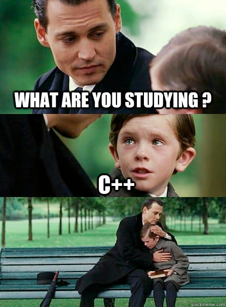

# Vorab

[Zurück](../../Readme.md)

---

## C++, Java oder Python: Welche Programmiersprache erlernt sich am leichtesten?

Diese Frage lässt sich nicht pauschal beantworten.
Es kommt dabei auf den individuellen Wissensstand
und die persönlichen Fähigkeiten an.
Dem einen liegen JavaScript und Python als Einstieg,
dem anderen eher Java, C++ und C#.

Wenn man alle möglichen Kandidaten für einen Einstieg in die Programmierung betrachtet,
muss man leider konstatieren, dass C++ eher zu den schwierigeren Sprachen zählt.

<p>
&nbsp;&nbsp;&nbsp;&nbsp;&nbsp;&nbsp;&nbsp;&nbsp;&nbsp;
</p>

*Abbildung* 1: C++ &ndash; *Relax*!

<sup>(Credits: [Don’t Trust a Programmer Who Knows C++](https://analyticsindiamag.com/dont-trust-a-programmer-who-knows-c/))</sup>


Nichtsdestotrotz ist diese Programmiersprache aus der systemnahen Software-Entwicklung
und vielen anderen Einsatzbereichen nicht mehr wegzudenken.

Ziel dieses Repositories ist es, auf die wesentlichen Sprachkonzepte 
von C++ einzugehen!

Hierbei wurde versucht, die Erläuterungen und Beispiele auf dem Niveau von C++
für *Einsteiger* (mit elementaren Kenntnissen anderer Programmiersprachen wie zum Beipiel C oder Java) zu halten.
Features von C++, die vor allem unter den Begrifflichkeiten 
*Modern C++*, *C++ 11*, *C++ 14* etc. anzufinden sind, wurden bewusst außer Acht gelassen.

---

## Abgrenzung von anderen Programmiersprachen

Sollten Sie immer noch nicht davon überzeugt sein, sich den Strapazen des Erlernens von C++
auszusetzen, hier noch ein Versuch, Ihnen die Entscheidung mit einer kleinen
Einstiegsaufgabe schmackhaft zu machen:

*Aufgabe*:

**Shoot yourself in the foot**.

In Abhängigkeit von der von Ihnen präferierten Programmiersprache wären folgende Lösungen denkbar:

**C**: &ldquo;*You shoot yourself in the foot.*&rdquo;

**C++**: &ldquo;*You accidentally create a dozen instances of yourself and shoot them all in the foot. Providing emergency medical assistance is impossible since you can't tell which are bitwise copies and which are just pointing at others and saying, &ldquo;That's me, over there...&rdquo;*&rdquo;

**Python**: &ldquo;*You create a gun module, a gun class, a foot module, and a foot class. After realizing you can't point the gun at the foot, you pass a reference to the gun to a foot object. After the foot is blown up, the gun object remains alive for eternity, ready to shoot all future feet that may happen to appear.*&rdquo;

**Java**: &ldquo;*You write a program to shoot yourself in the foot and put it on the Internet. People all over the world shoot themselves in the foot, and everyone leaves your website hobbling and cursing.*&rdquo;

**FORTRAN**: &ldquo;*You shoot yourself in each toe, iteratively, until you run out of toes, then you read in the next foot and repeat. If you run out of bullets, you continue with the attempts to shoot yourself anyway because you have no exception-handling capability.*&rdquo;

**Pascal**: &ldquo;*The compiler won't let you shoot yourself in the foot.*&rdquo;

**Ada**: &ldquo;*After correctly packing your foot, you attempt to concurrently load the gun, pull the trigger, scream, and shoot yourself in the foot. When you try, however, you discover you can't because your foot is of the wrong type.*&rdquo;

**COBOL**: &ldquo;*Using a COLT 45 HANDGUN, AIM gun at LEG.FOOT, THEN place ARM.HAND.FINGER on HANDGUN.TRIGGER and SQUEEZE. THEN return HANDGUN to HOLSTER. CHECK whether shoelace needs to be re-tied.*&rdquo;

**LISP**: &ldquo;*You shoot yourself in the appendage which holds the gun with which you shoot yourself in the appendage which holds the gun with which you shoot yourself in the appendage which holds the gun with which you shoot yourself in the appendage which holds the gun with which you shoot yourself in the appendage which holds the gun with which you shoot yourself in the appendage which holds ...*&rdquo;

**FORTH**: &ldquo;*Foot in yourself shoot.*&rdquo;

**Prolog**: &ldquo;*You tell your program that you want to be shot in the foot. The program figures out how to do it, but the syntax doesn't permit it to explain it to you.*&rdquo;

**BASIC**: &ldquo;*Shoot yourself in the foot with a water pistol. On large systems, continue until entire lower body is waterlogged.*&rdquo;

**Visual Basic**: &ldquo;*You'll really only _appear_ to have shot yourself in the foot, but you'll have had so much fun doing it that you won't care.*&rdquo;

**HyperTalk**: &ldquo;*Put the first bullet of gun into foot left of leg of you. Answer the result.*&rdquo;

**Motif**: &ldquo;*You spend days writing a UIL description of your foot, the bullet, its trajectory, and the intricate scrollwork on the ivory handles of the gun. When you finally get around to pulling the trigger, the gun jams.*&rdquo;

**APL**: &ldquo;*You shoot yourself in the foot, then spend all day figuring out how to do it in fewer characters.*&rdquo;

**SNOBOL**: &ldquo;*If you succeed, shoot yourself in the left foot. If you fail, shoot yourself in the right foot.*&rdquo;

**Unix**:
```
% ls
foot.c foot.h foot.o toe.c toe.o
% rm * .o
rm:.o no such file or directory
% ls
%
```

**Concurrent Euclid**: &ldquo;*You shoot yourself in somebody else's foot.*&rdquo;

**370 JCL**: &ldquo;*You send your foot down to MIS and include a 400-page document explaining exactly how you want it to be shot. Three years later, your foot comes back deep-fried.*&rdquo;

**Paradox**: &ldquo;*Not only can you shoot yourself in the foot, your users can, too.*&rdquo;

**Access**: &ldquo;*You try to point the gun at your foot, but it shoots holes in all your Borland distribution diskettes instead.*&rdquo;

**Revelation**: &ldquo;*You're sure you're going to be able to shoot yourself in the foot, just as soon as you figure out what all these nifty little bullet-thingies are for.*&rdquo;

**Assembler**: &ldquo;*You try to shoot yourself in the foot, only to discover you must first invent the gun, the bullet, the trigger, and your foot.*&rdquo;

**Modula2**: &ldquo;*After realizing that you can't actually accomplish anything in this language, you shoot yourself in the head.*&rdquo;

**CLARION**: &ldquo;*You tell your computer to create a program for shooting yourself in the foot.*&rdquo;


Fehlt eine Antwort? Weitere &ldquo;Abgrenzungen&rdquo; finden Sie
[hier](https://www-users.york.ac.uk/~ss44/joke/foot.htm).

---

[Zurück](../../Readme.md)

---
