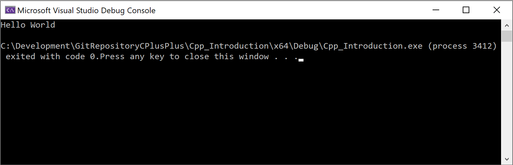

# &ldquo;Hello World&rdquo;

[Zurück](../../Readme.md)

---

## Erläuterungen

C++ ist eine Programmiersprache, die den vom Entwickler geschriebenen Quelltext des Programms (*Editor*)
zunächst mittels eines *Übersetzers* (*Compilers*)
in ein ausführbares Programm (*Maschinencode*) umgewandelt.

Erst dann kann das Programm ausgeführt werden.

In der *Visual Studio* Entwicklungsumgebung sind alle notwendigen Werkzeuge (Editor, Übersetzer)
vorhanden bwz. integriert.

Den Quelltext für ein &ldquo;Hello World&rdquo; Programm sieht so aus:

#### Datei [*Main.cpp*](../HelloWorld/Main.cpp):

```cpp
#include <iostream>

int main()
{
    std::cout << "Hello World" << std::endl;

    return 0;
}
```

Erstellen Sie mit der *Visual Studio* Entwicklungsumgebung ein C++&ndash;Projekt
und bringen Sie das Programm zum Laufen. Sie sollten dann folgende Ausgabe erhalten:



---

## Quellcode des Beispiels:

[*Main.cpp*](../HelloWorld/Main.cpp)

---

[Zurück](../../Readme.md)

---

