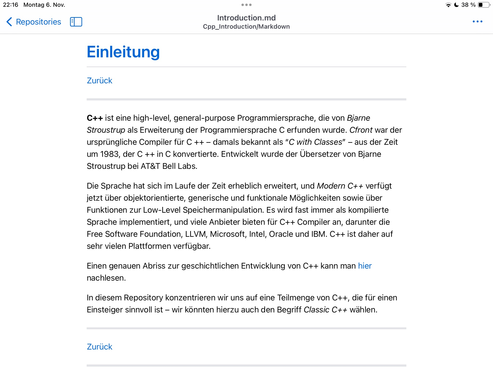
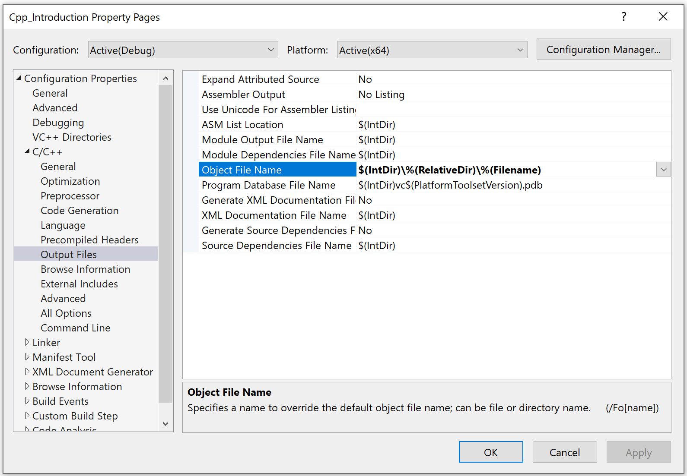

# Technische Hinweise

[Zurück](../../Readme.md)

---

## Compiler / Entwicklungsumgebung

Das Repository wurde mit der &ldquo;*Visual Studio*&rdquo; Entwicklungsumgebung 2022 erstellt.
Alle Beispiel müssten aber auch mit dem GCC Compiler übersetzungsfähig sein.

---

## GitHub Mobile

GitHub-Repositories können auf mobilen Devices (IOS, Android) auch mit der jeweiligen
*GitHub Mobile App* betrachten werden:


<p>
  
</p>


*Abbildung* 1: Ausschnitt des Repositories auf einem iPhone.

Und hier zum Vergleich auf einem iPad:

<p>
  
</p>

*Abbildung* 2: Ausschnitt des Repositories auf einem iPad.


---

## Mehrere Dateien desselben Namens

In diesem Projekt befinden sich viele Dateien mit demselben Namen wie
zum Beispiel `Main.cpp`, `Time.h` etc., natürlich in unterschiedlichen Verzeichnissen.

Nichtsdestotrotz legt der Visual C++ Compiler bzw. die Entwicklungsumgebung
die bei der Übersetzung resultierenden `.obj`-Dateien in einem Verzeichnis ab,
was natürlich zu Konflikten führt.

Eine Lösung wäre es, alle Dateien des Projekts unterschiedlich zu benennen.
Da es beispielsweise sehr viele Varianten eines Entwurfs einer Klasse `Time` gibt,
würde dies zu sehr unschönen Namen wie `Time01.h`, `Time02.h`, etc. führen,
worunter die Übersichtlichkeit des Projekts doch sehr leidet.

Es gibt eine andere Möglichkeit:
In den Projekt-Einstellungen lassen sich dateispezifische Ablageorte
für derartige Konfliktdateien festlegen:

Man verwende

in der Eigenschaft

```
„Objektdateiname“ (deutsche Visual Studio Installation)
```

bzw.

```
„Object File Name“ (englische Visual Studio Installation)
```

den Wert

```
$(IntDir)\%(RelativeDir)\%(Filename)
```

Diese Einstellung findet man unter dem Pfad

*(Konfigurationseigenschaften -> C/C++ -> Ausgabedateien -> Objektdateiname)*

bzw.

*(Properties -> C/C++ -> Output Files -> Objektdateiname)*


Siehe hierzu auch *Abbildung* 3:



*Abbildung* 3: Einstellungen eines Visual Studio Projekts.


---

[Zurück](../../Readme.md)

---
