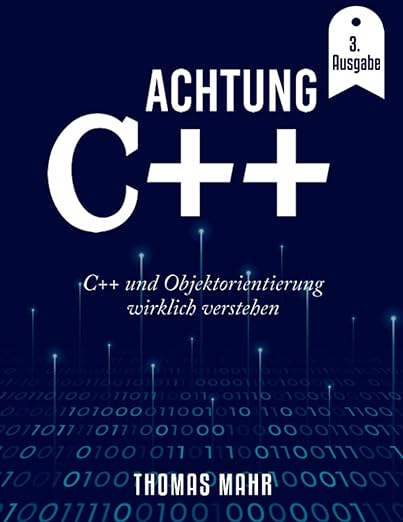
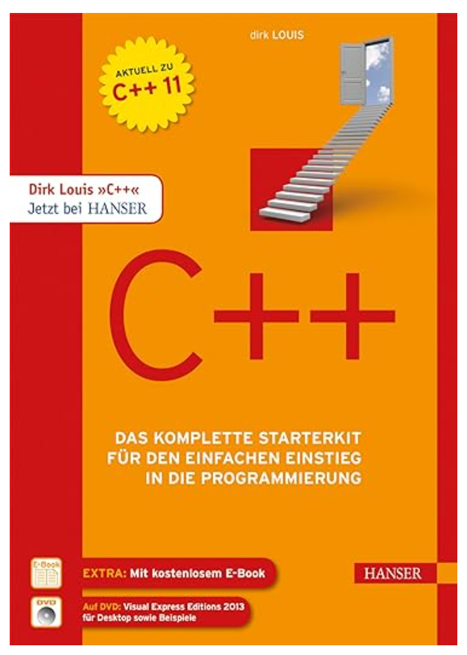
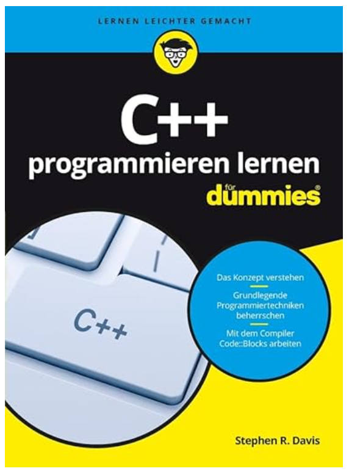
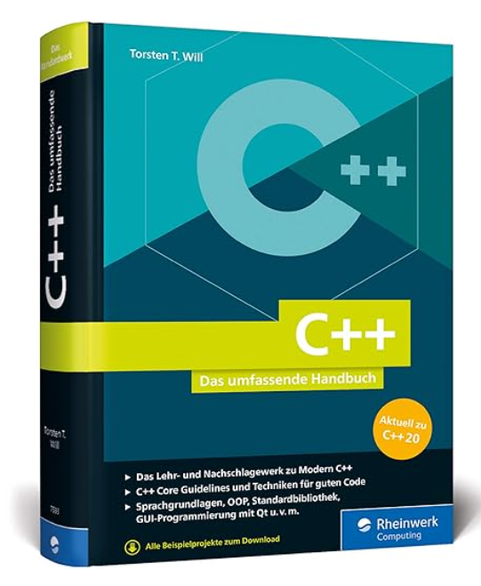
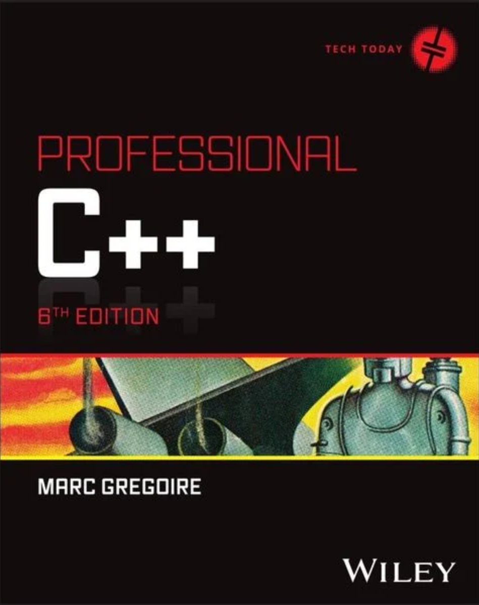

# Literatur

[Zurück](../../Readme.md)

---

## C++

  * Thomas Mahr, &bdquo;*Achtung C++: C++ und Objektorientierung wirklich verstehen*&rdquo;. 
    Independently Published (7. März 2022), 398 Seiten. Sprache: Deutsch. ISBN-13: 979-8427916370.

    

---

  * Dirk Louis, &bdquo;*C++ &ndash; Das komplette Starterkit für den einfachen Einstieg in die Programmierung*&rdquo;. 
    Hanser Fachbuch (9. April 2018), 490 Seiten. Sprache: Deutsch. ISBN-13: 978-3446445970, ISBN-10: 3446445978.
   

    

---

  * Stephen R. Davis , &bdquo;*C++ Programmieren lernen für Dummies*&rdquo;.  
    Wiley-VCH (10. August 2016), 456 Seiten. Sprache: Deutsch. ISBN-10: 3527713182, ISBN-13: 978-3527713189.

    

---

  * Torsten T. Will, &bdquo;*C++: Das umfassende Handbuch zu Modern C++ - aktuell zu C++17*&rdquo;.  
    Rheinwerk Computing (27. Dezember 2017), 1067 Seiten. Sprache: Deutsch. ISBN-10: 3836243601, ISBN-13: 978-3836243605.

    

---

  * Marc Gregoire, &bdquo;*Professional C++ (6. Auflage)*&rdquo;.  
    Wrox (12. Februar 2024), 1376 Seiten. Sprache: Englisch. ISBN-10: 1394193173, ISBN-13: 978-1394193172.

    

---

#### WebSite &bdquo;Learn C++&rdquo;

  * [Learn C++](https://www.learncpp.com/)

    Aus der Einführung:

    *&bdquo;LearnCpp.com is a free website devoted to teaching you how to program
    in C++. Whether you’ve had any prior programming experience or not,
    the tutorials on this site will walk you through all the steps to write,
    compile, and debug your C++ programs, all with plenty of examples.&rdquo;*

    *&bdquo;Becoming an expert won’t happen overnight, but with a little patience,
     you’ll get there. And LearnCpp.com will show you the way.&rdquo;*

---

## Frameworks, Bibliotheken, Ressources und mehr ...

  * [Awesome C++](https://github.com/fffaraz/awesome-cpp)

    Eine kuratierte Liste von C++ (oder C)-Frameworks, Bibliotheken, Ressourcen und anderen Informationen
    für den interessierten C++-Entwickler.

---

[Zurück](../../Readme.md)

---
