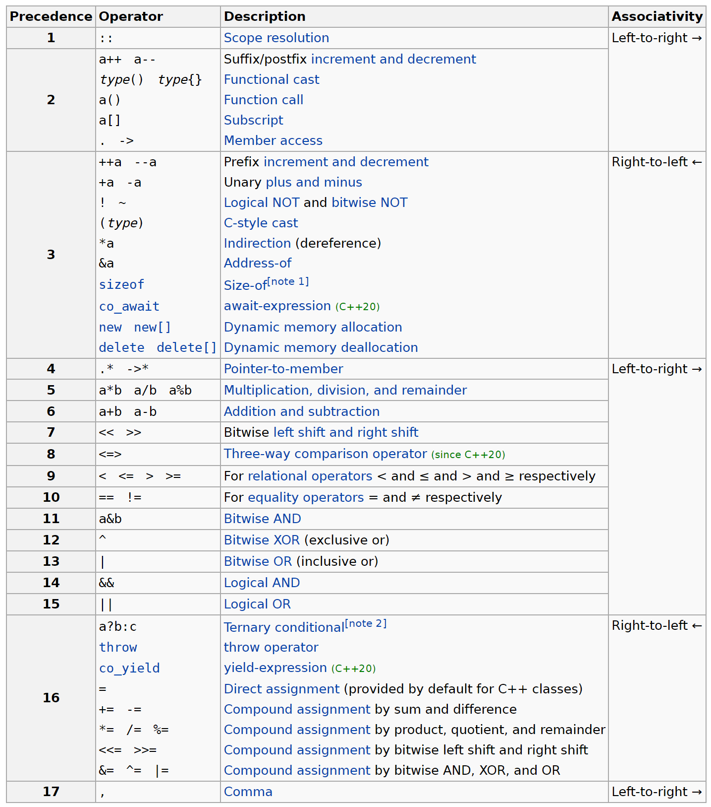

# Überladen von Operatoren

[Zurück](Agenda.md)

---

## Erläuterungen

### Allgemeines

C++ verfügt über eine Reihe vordefinierter Typen, beispielsweise `int`, `float` oder `char`.
Zu jedem dieser Typen gehören verschiedene vordefinierte Operatoren
wie Addition (`+`) und Multiplikation (`*`).

In C++ können Sie diese Operatoren auch für Klassen definieren.

*Beispiel*:

Das folgende Code-Fragment ist gewissermaßen &ldquo;selbstverständlich&rdquo; übersetzungsfähig:


```cpp
int n = 123;
int m = 456;

if (n == m) {
    std::cout << "n and m are equal" << std::endl;
}
```

Wie sieht es mit diesem Code-Fragment aus?

```cpp
Time now(10, 20, 30);
Time later(17, 0, 0);

if (now == later) {
    std::cout << "'now' and 'later' are equal" << std::endl;
}
```

Ohne unser Zutun erhalten wir hier eine Fehlermeldung:

```
Error binary '==': 'Time' does not define this operator
```

Mit dem Sprachfeature *Überladen von Operatoren*
können wir das letzte Beispiel zum Laufen bringen!

### Stelligkeit und Priorität

In der folgenden Tabelle sind die Rangfolge und Assoziativität von C++&ndash;Operatoren aufgeführt.
Die Operatoren werden von oben nach unten in absteigender Reihenfolge aufgelistet.



*Tabelle* 1: Vorrang der C++&ndash;Operatoren.

<sup>Entnommen aus [C++ Operator Precedence](https://en.cppreference.com/w/cpp/language/operator_precedence)</sup>


Zu den Begriffen:

  * *Stelligkeit*:<br />
    Der Begriff *Stelligkeit* steht für die Anzahl der Argumente eines Operators.
    Einstellige Operatoren benötigen nur einen Operanden.
    Beispiel ist etwa der Minus-Operator (`-`), um von einer Zahl (einer Variablen) den negativen Wert zu bestimmen.
    Zweistellige Operatoren benötigen zwei Operanden.
    Beispiele sind etwa die arithmetischen Operationen
    Addition, Subtraktion, Multiplikation, oder Division, oder die logischen Operationen
    &ldquo;Logisches Und&rdquo; (`&&`)  und
    &ldquo;Logisches Oder&rdquo; (`||`).

  * *Priorität* :<br />
    Zunächst einmal ganz einfach formuliert:
    Unter der *Priorität* von Operatoren versteht man die *Punkt- vor Strich*&ndash;Regel.
    Etwas allgemeiner und formaler ausgedrückt:
    Für jeden Operator wird eine *Priorität* festgelegt, indem jedem Operator ein Rang zugeordnet wird.
    Dieser Rang entscheidet das Gruppieren und die Auswertung von Operanden in arithmetischen Ausdrücken.
    Ausdrücke mit höherrangigen Operatoren werden zuerst ausgewertet.
    Diese (im englischen als *Operator-Precedence* bezeichnete) Rangordnung
    stellt die Assoziativität verschiedenartiger Operatoren aufgrund deren Priorität sicher.


### Assoziativität

Mit der *Priorität* von Operatoren beschreibt man die Reihenfolge in der Auswertung
von arithmetischen Ausdrücken mit unterschiedlichen Operatoren.
Was aber, wenn es sich um denselben Operator handelt
(oder um verschiedene Operatoren, aber mit gleichem Vorrang),
zum Beispiel

```cpp
int x = 1 - 2 - 3;
```

Besitzt `n` den Wert -4 oder 2? Okay, Sie werden vermutlich für den Wert -4 plädieren
auf Grund der Vorgehensweise: Ich lese den Ausdruck von &ldquo;links nach rechts&rdquo;.

Okay, wie sieht es mit diesem Code-Fragment aus?

```cpp
int a = 1;
int b = 2;
int c = 3;

int d;

d = c = b = a;
```

Dies ist schon eher eine subtile Form der Wertzuweisung:
Wir sprechen von einer so genannten *Mehrfachzuweisung*:
Sie wird von &ldquo;rechts nach links&rdquo; abgearbeitet,
also im vorliegenden Beispiel wird als erstes `b` der Wert von `a` zugewiesen
(also `1`), dieser Wert wird danach der Variablen `c` zugewiesen und schließlich der Variablen `d`.

Hieraus hat sich der Begriff der *Assoziativität* von Operatoren entwickelt:

  * *Assoziativität* :<br />
    Die Assoziativität gibt an, ob eine Folge von Operatoren gleichen Vorrangs von links oder von rechts abgearbeitet wird.


## Beispiele

Das Überladen von Operatoren kann in C++ technisch betrachtet auf zwei Weisen erfolgen:

  * Durch Realisierung spezieller Methoden &ndash; innerhalb der Klasse
  * Durch globale Funktionen &ndash; außerhalb der Klasse.


Das Überladen eines Operators innerhalb der Klasse ist nahezu identisch zur
Realisierung einer Methode. Der einzige offene Punkt ist: Welchen Namen hat diese Methode?

Er wird gebildet aus dem Schlüsselwort `operator` gefolgt von dem Operator selbst, also zum 
Beispiel `operator==`

*Hinweis*:
Man kann zwischen `operator` und `==` ein Leerzeichen einfügen,
wenn dies für Sie besser lesbar ist.


### Realisierung innerhalb der Klasse 

Wir betrachten am Beispiel der Klasse `Time`
die sechs Vergleichsoperatoren `==`, `!=`, `<`, `<=`, `>` und `>=`.

Studieren Sie sorgfältig die folgenden Ergänzungen in der Klasse `Time`:

#### Datei *Time.h* (in Ausschnitten):

```cpp
01: class Time
02: {
03: private:
04:     int m_seconds;
05:     int m_minutes;
06:     int m_hours;
07: 
08: public:
09:     // c'tors
10:     Time();
11:     Time(int hours, int minutes, int seconds);
12: 
13:     // comparison operators: as member methods
14:     bool operator== (const Time& other);
15:     bool operator!= (const Time& other);
16:     bool operator<= (const Time& other);
17:     bool operator<  (const Time& other);
18:     bool operator>= (const Time& other);
19:     bool operator>  (const Time& other);
20: 
21:     ...
22: };
```

#### Datei *Time.cpp* (in Ausschnitten):

```cpp
01: // comparison operators
02: bool Time::operator== (const Time& other) {
03:     return
04:         m_seconds == other.m_seconds &&
05:         m_minutes == other.m_minutes &&
06:         m_hours == other.m_hours;
07: }
08:     
09: bool Time::operator!= (const Time& other) {
10:     return ! (*this == other);
11: }
12:     
13: bool Time::operator<  (const Time& other) {
14:     if (m_hours < other.m_hours)
15:         return true;
16: 
17:     if (m_hours == other.m_hours && m_minutes < other.m_minutes)
18:         return true;
19: 
20:     if (m_hours == other.m_hours && m_minutes == other.m_minutes && m_seconds < other.m_seconds)
21:         return true;
22: 
23:     return false;
24: }
25: 
26: bool Time::operator<= (const Time& other) {
27:     return *this < other || *this == other;
28: }
29:     
30: bool Time::operator>  (const Time& other) {
31:     return !(*this <= other);
32: }
33: 
34: bool Time::operator>= (const Time& other) {
35:     return !(*this < other);
36: }
```

#### Datei *Main.cpp* - Testrahmen:

Ein Testrahmen mit 2 Objekten `now` und `later`:

```cpp
01: void testTimeOperators()
02: {
03:     using namespace OperatorOverloading;
04: 
05:     Time now(10, 20, 30);
06:     Time later(17, 0, 0);
07: 
08:     if (now == later) {
09:         std::cout << "'now' and 'later' are equal" << std::endl;
10:     }
11:     else {
12:         std::cout << "'now' and 'later' are not equal" << std::endl;
13:     }
14: 
15:     if (now < later) {
16:         std::cout << "'now' is less than 'later'" << std::endl;
17:     }
18: }
```

*Ausgabe*:


```
'now' and 'later' are not equal
'now' is less than 'later'
```

### Realisierung außerhalb der Klasse 

Studieren Sie sorgfältig die folgenden Änderungen in der Datei *Time.h*.
Die Operatoren werden außerhalb der Klasse `Time` als globale Funktion
deklariert und implementiert.

Welche Unterschiede in der Realisierung fallen Ihnen auf?

#### Datei *Time.h* (in Ausschnitten):

```cpp
01: class Time
02: {
03: private:
04:     int m_seconds;
05:     int m_minutes;
06:     int m_hours;
07: 
08: public:
09:     ...
10: 
11:     // getter // setter
12:     int getSeconds() const { return m_seconds; }
13:     int getMinutes() const { return m_minutes; }
14:     int getHours() const { return m_hours; }
15:     void setSeconds(int seconds);
16:     void setMinutes(int minutes);
17:     void setHours(int hours);
18: 
19:     ...
20: };
21: 
22: // comparison operators as global methods
23: bool operator== (const Time& left, const Time& right);
24: bool operator!= (const Time& left, const Time& right);
25: bool operator<= (const Time& left, const Time& right);
26: bool operator<  (const Time& left, const Time& right);
27: bool operator>= (const Time& left, const Time& right);
28: bool operator>  (const Time& left, const Time& right);
```

#### Datei *Time.cpp* (in Ausschnitten):

```cpp
01: // comparison operators as global methods
02: bool operator== (const Time& left, const Time& right)
03: {
04:     return
05:         left.getSeconds() == right.getSeconds() &&
06:         left.getMinutes() == right.getMinutes() &&
07:         left.getHours() == right.getHours();
08: }
09: 
10: bool operator!= (const Time& left, const Time& right)
11: {
12:     return !(left == right);
13: }
14: 
15: bool operator<= (const Time& left, const Time& right)
16: {
17:     return left < right || left == right;
18: }
19: 
20: bool operator< (const Time& left, const Time& right)
21: {
22:     if (left.getHours() < right.getHours())
23:         return true;
24: 
25:     if (left.getHours() == right.getHours() && left.getMinutes() < right.getMinutes())
26:         return true;
27: 
28:     if (left.getHours() == right.getHours() && left.getMinutes() == right.getMinutes() && left.getSeconds() < right.getSeconds())
29:         return true;
30: 
31:     return false;
32: }
33: 
34: bool operator>= (const Time& left, const Time& right)
35: {
36:     return !(left < right);
37: }
38: 
39: bool operator>  (const Time& left, const Time& right)
40: {
41:     return !(left <= right);
42: }
```

*1. Bemerkung*:
Die Schnittstellen der Operatoren-Methoden haben sich geändert:
Da es sich um globale Funktionen handelt, müssen nun für die zwei Operanden des Vergleichs
zwei Parameter vorhanden sein.

*2. Bemerkung*:
Globale Funktionen haben keinen Zugang zu privaten Daten einer Klasse.
Aus diesem Grund muss nun jeder Zugriff auf ein `Time`-Objekt den Weg über die
öffentliche Schnittstelle der Klasse gehen, hier: Gebrauch von *setter*-Methoden.

*3. Bemerkung*:
Betrachten Sie die aktuellen *getter*-Methoden genau:
Da die Referenz-Parameter der Operatoren-Methoden mit dem Schlüsselwort `const` markiert sind,
dürfen in der Realisierung der Operatoren-Methoden nun ebenfalls nur `const`-Methoden zum
Einsatz kommen, siehe zum Beispiel

<pre>
int getSeconds() <b>const</b> { return m_seconds; }
</pre>


Der Testrahmen ist unverändert wie im letzten Abschnitt gezeigt
übersetzungs- und lauffähig.

### Realisierung außerhalb der Klasse - mit *Freundschaft*

Die Bemerkungen zur letzten Realisierungsvariante haben einige Probleme in der Implementierung
angesprochen. Mit dem Schlüsselwort `friend` lassen diese sich umgehen:

#### Datei *Time.h* (in Ausschnitten):

```cpp
01: class Time
02: {
03: private:
04:     int m_seconds;
05:     int m_minutes;
06:     int m_hours;
07: 
08: public:
09:     ...
10: 
11:     // comparison operators - global methods declared as friends
12:     friend bool operator== (const Time& left, const Time& right);
13:     friend bool operator!= (const Time& left, const Time& right);
14:     friend bool operator<= (const Time& left, const Time& right);
15:     friend bool operator<  (const Time& left, const Time& right);
16:     friend bool operator>= (const Time& left, const Time& right);
17:     friend bool operator>  (const Time& left, const Time& right);
18:     
19:     ...
20: };
```

#### Datei *Time.cpp* (in Ausschnitten):

```cpp
01: // comparison operators as global methods -  using 'friendship'
02: bool operator== (const Time& left, const Time& right)
03: {
04:     return
05:         left.m_seconds == right.m_seconds &&
06:         left.m_minutes == right.m_minutes &&
07:         left.m_hours == right.m_hours;
08: }
09: 
10: bool operator!= (const Time& left, const Time& right)
11: {
12:     return !(left == right);
13: }
14: 
15: bool operator<= (const Time& left, const Time& right)
16: {
17:     return left < right || left == right;
18: }
19: 
20: bool operator<  (const Time& left, const Time& right)
21: {
22:     if (left.m_hours < right.m_hours)
23:         return true;
24: 
25:     if (left.m_hours == right.m_hours && left.m_minutes < right.m_minutes)
26:         return true;
27: 
28:     if (left.m_hours == right.m_hours && left.m_minutes == right.m_minutes && left.m_seconds < right.m_seconds)
29:         return true;
30: 
31:     return false;
32: }
33: 
34: bool operator>= (const Time& left, const Time& right)
35: {
36:     return !(left < right);
37: }
38: 
39: bool operator>  (const Time& left, const Time& right)
40: {
41:     return !(left <= right);
42: }
```

*Achtung*:
Der Gebrauch des `friend`-Mechanismus ist mit Vorsicht zu genießen:
Es wird hiermit nichts weniger als der private Deklarationsabschnitt einer Klasse
auf den Modus *öffentlich* umgestellt &ndash; für *Freunde*.

---

## Quellcode des Beispiels:

[Time.h](..\OperatorOverloading\Time.h)<br />
[Time.cpp](..\OperatorOverloading\Time.cpp)<br />
[Main.cpp](..\OperatorOverloading\Main.cpp)

---


## Übungen

TBD: Weitere Operatoren


---


[Zurück](Agenda.md)

---
