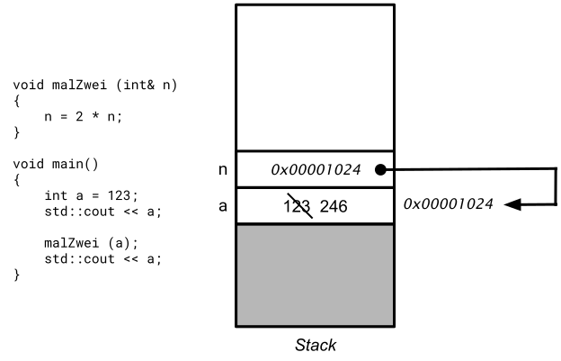

# Technik der Übergabe von Parametern


[Zurück](Agenda.md)

---

## Erläuterungen

Es gibt verschiedene Möglichkeiten, Parameter an Methoden (Funktionen) zu übergeben.

*Vorab zur Nomenklatur*:

Die an die Funktion übergebenen Parameter werden als *Aktualparameter* (*actual parameter*) bezeichnet,
während die von der Funktion empfangenen Parameter als *Formalparameter* (*formal parameter*) bezeichnet werden.

*Beispiel*:

```cpp
void func(int a, int b)
{
    int sum;

    sum = a + b;

    std::cout << "In func: a = " << a << ", b = " << b << ", sum = " << sum << std::endl;
}
    
void testFunc()
{
    int x = 123;
    int y = 456;

    // passing parameters
    func(x, y);

    // passing again parameters
    func(123, 321);
}
```

Funktion `func` besitzt die beiden formalen Parameter `a` und `b` (vom Datentyp `int`).
Als Aktualparameter treten die beiden Variablen `x` und `y` sowohl die Konstanten `123` und `321` in Erscheinung.


### Parameterübergabemechanismus *Call-by-Value*

Bei der *Call-by-Value*-Aufrufmethode der Parameterübergabe werden die Werte der Aktualparameter
in die formalen Parameter der Funktion kopiert.

Es gibt folglich pro Parameter zwei verschiedene Speicherorte, an denen der Wert eines Parameters vorhanden ist:

  * Einen originalen Speicherort, der den Wert des Aktualparameters als Inhalt hat.
  * Eine Funktionskopie, die denselben Inhalt wie der originale Speicherort hat, aber nur in der Funktion verfügbar ist.

Alle innerhalb von Funktionen vorgenommenen Änderungen werden an den Funktionskopien vorgenommen und damit
nicht in den tatsächlichen Parametern (originaler Speicherort) des Funktionsaufrufs widergespiegelt.


*Abbildung* 1: Parameterübergabemechanismus *Call-by-Value*.


### Parameterübergabemechanismus *Call-by-Reference*

Bei der *Call-by-Reference*-Aufrufmethode wird die Adresse des Aktualparameters als formaler Parameter an die Funktion übergeben.

  * Sowohl der Aktualparameter als auch der formale Parameter (Funktionskopie) beziehen sich damit auf denselben Speicherort.
  * Alle innerhalb der Funktion vorgenommenen Änderungen an den Funktionskopien
    spiegeln sich in den aktuellen Parametern des Aufrufs wider.




*Abbildung* 2: Parameterübergabemechanismus *Call-by-Reference*.


**Zur Abrundung**:

### Parameterübergabemechanismus *Call-by-Address*

Im Prinzip ist diese Aufrufmethode identisch zur *Call-by-Reference*-Methode.
Da wir in C++ die beiden Sprachmittel *Zeiger* und *Referenz* haben,
können Aktualparameter durch eine explizite Adresse (explizite Verwendung des Adress-Operators `&`)
oder eben durch eine Referenz (Adresse wird implizit gebildet) übergeben werden.
Im zweiten Fall bedarf es keines Gebrauchs des Adress-Operators,
allerdings muss der Parameter der Funktion vom Typ *Referenz* sein.


## Beispiele

Studieren Sie sorgfältig die folgenden drei Realisierungen einer Funktion `multiplyByTwo`:

#### Datei [*Main.cpp*](../ParameterPassingTechniques/Main.cpp) - Testrahmen:

```cpp
01: void multiplyByTwo(int n)
02: {
03:     n = 2 * n;
04: }
05: 
06: void multiplyByTwo(int* ip) 
07: {
08:     int tmp = *ip; 
09:     tmp = 2 * tmp;
10:     *ip = tmp;
11: }
12: 
13: void multiplyByTwo(int& n) 
14: {
15:     n = 2 * n;
16: }
```

```cpp
void testMultiplyByTwo()
{
    int x = 10;

    std::cout << x << std::endl;
    multiplyByTwo01(123);
    std::cout << x << std::endl;

    multiplyByTwo02(&x);           // &: address-of / pointer is passed
    std::cout << x << std::endl;

    multiplyByTwo03(x);            // a reference of 'x' is passed
    std::cout << x << std::endl;
}
```

*Ausgabe*:

```
10
10
20
40
```

*Hinweis*:
Der Datentyp *Zeiger* (*Pointer*) ist Bestandteil der Programmiersprache C &ndash; und deshalb gewissermaßen automatisch
auch in C++ vorhanden. Auf Grund der nicht ganz einfachen Syntax bzw. Handhabung dieses Sprachmittels
wurde in C++ der Sprachkonstrukt der *Referenz* hinzugefügt.
Aus diesem Grund lassen sich nun Funktionen wie `multiplyByTwo` prinzipiell auf zwei Weisen programmieren.
Man sollte aber immer, wenn möglich, den Referenzen den Vorzug geben.

*Hinweis*:
Warum ist für die Aufrufmethoden *Call-by-Address* und *Call-by-Reference* die folgende Anweisung
nicht übersetzungsfähig?

```cpp
multiplyByTwo(123);
```

---

## Quellcode des Beispiels:

[*Main.cpp*](../ParameterPassingTechniques/Main.cpp)

---

## Aufgaben

[Funktion `swap`](../Exercises/Exercises_References_Pointers.md)

---

[Zurück](Agenda.md)

---


