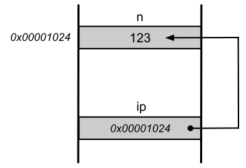
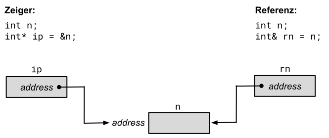

# Referenzen


[Zurück](Agenda.md)

---

## Erläuterungen

Variablen sind Bezeichner, denen ein Datentyp zugeordnet ist.
Eine Variable 

```cpp
int n = 123;
```

wird auf Grund ihrer Deklaration vom Typ `int` im Speicher so angeordnet,
dass sie &ndash; auf den meisten Rechern in 4 Bytes &ndash; einen ganzzahligen Wert
aufnehmen kann.

Auf die Adresse, an der diese Variable im Speicher liegt, hat der Programmierer
so gut wie keinen Einfluss. Es sind Tools wie der *Linker* und der *Loader*,
die hierfür die Entscheidungen treffen:


*Abbildung* 1: Eine Variable `n` im Speicher an einer fiktiven Adresse *0x00001024*.


*Zeiger* (*Pointer*) der Programmiersprache C/C++ sind eine Möglichkeit,
um auf Objekte (Variablen) indirekt zugreifen zu können.
&bdquo;Indirekt&rdquo; bedeutet in diesem Fall, dass in einem C/C++&ndash;Programm
auch Adressen ins Spiel kommen:


```cpp
int n = 123;
int* ip = &n;
```



*Abbildung* 2: Eine Variable und ein Zeiger, der auf die Variable zeigt.


*Referenzen*, die es nur in der Programmiersprache C/C++ gibt, bieten nahezu die gleichen Möglichkeiten wie Zeiger,
aber mit einer *einfacheren* Syntax:


```cpp
int n = 123;
int& rn = n;
```




*Abbildung* 3: Ein Zeiger und eine Referenz, die auf dieselbe Variable verweisen.


Es ist wichtig zu verstehen, 

  * was Referenzen sind,
  * wie sich Referenzen von Zeigern unterscheiden,
  * wie man Referenzen erzeugt und verwendet,
  * welche Beschränkungen für Referenzen gelten und
  * wie man Werte und Objekte in und aus Funktionen (Methoden) als Referenz übergibt.


### Was ist eine Referenz?

Eine *Referenz* ist ein *Alias*-Name. 

Wenn man eine Referenz erzeugt, initialisiert man sie mit dem Namen eines
anderen Objekts, dem Zielobjekt.

Von diesem Moment an ist die Referenz wie ein alternativer Name für das Zielobjekt, und alles,
was man mit der Referenz anstellt, bezieht sich tatsächlich auf das Zielobjekt.

Die Deklaration einer Referenz besteht aus dem Typ des Zielobjekts,
gefolgt vom Referenzoperator (`&`) und dem Namen der Referenz.

Viele Programmierer stellen Referenzvariablen ein `r` voran.
Zum Beispiel erzeugt man für eine `int`-Variable `rn` eine Referenz mit der folgenden Anweisung:

```cpp
int n = 123;
int &rn = n;
```

Wir betrachten ein Beispiel zu Referenzen:

#### Datei [*Main.cpp*](../References/Main.cpp):

```cpp
01: void referencesUnderstanding()
02: {
03:     int anInteger;
04:     int& rSomeRef = anInteger;
05: 
06:     anInteger = 123;
07:     std::cout << "anInteger: " << anInteger << std::endl;
08:     std::cout << "rSomeRef:  " << rSomeRef << std::endl;
09: 
10:     rSomeRef = 456;
11:     std::cout << "anInteger: " << anInteger << std::endl;
12:     std::cout << "rSomeRef:  " << rSomeRef << std::endl;
13: }
```

Zeile 3 deklariert die lokale `int`-Variable `anInteger`.
In Zeile 4 wird `rSomeRef` als Referenz auf `int` deklariert
und mit `anInteger` initialisiert.

Wenn man eine Referenz deklariert, aber nicht initialisiert, erhält man einen
Übersetzungsfehler. Referenzen müssen initialisiert werden.

Zeile 6 weist `anInteger` den Wert 123 zu. Die Anweisungen in den Zeilen 7 und 8 geben die Werte in `anInteger`
und `rSomeRef` aus. Natürlich sind sie gleich, da `rSomeRef` lediglich die Referenz auf `anInteger` ist.

In Zeile 10 steht die Zuweisung von 456 an `rSomeRef`. Da es sich um eine Referenz handelt,
bezieht sich die Zuweisung von 456 auf `anInteger`, wie es die Ausgaben in den Zeilen 11 und 12
belegen.

*Ausgabe*:

```
anInteger: 123
rSomeRef:  123
anInteger: 456
rSomeRef:  456
```


### Der Adreßoperator `&` bei Referenzen

Wenn man die Adresse einer Referenz abfragt, erhält man die Adresse des Ziels der Referenz.
Genau das ist das
Wesen der Referenzen &ndash; sie sind Alias-Adressen für das Ziel. 
Das folgende Code-Fragment verdeutlicht diesen Sachverhalt:

#### Datei [*Main.cpp*](../References/Main.cpp):

```cpp
01: void referencesAndAddressOperator()
02: {
03:     int anInteger;
04:     int& rSomeRef = anInteger;
05: 
06:     anInteger = 123;
07:     std::cout << "anInteger:  " << anInteger << std::endl;
08:     std::cout << "rSomeRef:   " << rSomeRef << std::endl;
09: 
10:     std::cout << "&anInteger: " << &anInteger << std::endl;
11:     std::cout << "&rSomeRef:  " << &rSomeRef << std::endl;
12: }
```

*Ausgabe*:

```
anInteger:  123
rSomeRef:   123
&anInteger: 00000012E86FFA94
&rSomeRef:  00000012E86FFA94
```

Auch hier wird `rSomeRef` als Referenz auf `anInteger` initialisiert.
Die Ausgabe zeigt diesmal die Adressen der beiden Variablen &ndash; sie sind identisch.

C++ bietet keine Möglichkeit, auf die Adresse der Referenz selbst
zuzugreifen, da sie im Gegensatz zu einem Zeiger oder einer anderen Variablen nicht von Bedeutung ist.
Referenzen werden bei ihrer Erzeugung initialisiert und agieren immer als Synonym für ihre Ziel, selbst wenn
man den Adreßoperator anwendet.


### Referenzen können nicht erneut zugewiesen werden

Selbst erfahrene C++-Programmierer, die die Regel kennen, daß Referenzen nicht erneut zugewiesen werden
können und immer Alias-Adressen für ihr Ziel sind, wissen manchmal nicht, was beim erneuten Zuweisen einer
Referenz passiert. Was wie eine Neuzuweisung aussieht, stellt sich als Zuweisung eines neuen Wertes an das Ziel
heraus. Diese Tatsache belegt das folgende Code-Fragment:

#### Datei [*Main.cpp*](../References/Main.cpp):

```cpp
01: void referencesAndReAssignment()
02: {
03:     int anInteger;
04:     int& rSomeRef = anInteger;
05: 
06:     anInteger = 123;
07:     std::cout << "anInteger:      " << anInteger << std::endl;
08:     std::cout << "rSomeRef:       " << rSomeRef << std::endl;
09:     std::cout << "&anInteger:     " << &anInteger << std::endl;
10:     std::cout << "&rSomeRef:      " << &rSomeRef << std::endl;
11:     std::cout << std::endl;
12: 
13:     int secondInteger = 456;
14: 
15:     rSomeRef = secondInteger;
16: 
17:     std::cout << "anInteger:      " << anInteger << std::endl;
18:     std::cout << "secondInteger:  " << secondInteger << std::endl;
19:     std::cout << "rSomeRef:       " << rSomeRef << std::endl;
20:     std::cout << "&anInteger:     " << &anInteger << std::endl;
21:     std::cout << "&secondInteger: " << &secondInteger << std::endl;
22:     std::cout << "&rSomeRef:      " << &rSomeRef << std::endl;
23: }
```

*Ausgabe*:

```
anInteger:      123
rSomeRef:       123
&anInteger:     00000087042FF4A4
&rSomeRef:      00000087042FF4A4

anInteger:      456
secondInteger:  456
rSomeRef:       456
&anInteger:     00000087042FF4A4
&secondInteger: 00000087042FF4E4
&rSomeRef:      00000087042FF4A4
```

Die Zeilen 3 und 4 deklarieren auch hier wieder eine `int`-Variable und eine Referenz auf `int`. In Zeile 6
wird der `int`-Variable der Wert 123 zugewiesen, und die Ausgabe der Werte und ihrer Adressen erfolgt in den
Zeilen 7 bis 11.

Zeile 13 erzeugt die neue Variable `secondInteger` und initialisiert sie mit dem Wert 456. In Zeile 15 versucht der
Programmierer, `rSomeRef` erneut als Alias-Adresse für die Variable `secondInteger` zuzuweisen. Allerdings passiert
etwas anderes: `rSomeRef` wirkt nämlich weiterhin als Alias-Adresse für `anInteger`, so daß diese Zuweisung mit
der folgenden gleichbedeutend ist:

```cpp
anInteger = secondInteger;
```

Tatsächlich sind die in den Zeilen 17 bis 19 ausgegebenen Werte von `anInteger` und `rSomeRef` gleich `secondInteger`.

### Null-Zeiger und Null-Referenzen

Wenn man Zeiger löscht oder nicht initialisiert, sollte man ihnen Null (`0` bzw. `nullptr`) zuweisen.
Für Referenzen gilt das nicht. In der Tat darf eine Referenz nicht Null sein.
Ein Programm mit einer Referenz auf ein Null-Objekt ist unzulässig.

Es ist aber auch nicht so einfach, eine Referenz gleich Null zu erzeugen,
da bei der Deklaration einer Referenz eine Vorbelegung mit der anderen,
zu referenzierenden Variablen vorhanden sein *muss*.

### Zeiger und Referenzen im Vergleich

#### Datei [*Main.cpp*](../References/Main.cpp):

```cpp
01: void referencesUnderstanding()
02: {
03:     int n = 123;
04:     int m;
05: 
06:     // using pointers
07:     int* ip;
08: 
09:     ip = &n;      // address-of
10:         
11:     m = *ip;      // value-of / same as: m = n;
12:         
13:     ++ip;
14:     m = *ip;      // m = ???
15:         
16:     --ip;
17:     m = *ip;      // again value of n
18: 
19:     // using references
20:     int& ri = n;
21:         
22:     m = ri;       // same as: m = n;
23:         
24:     ++ri;         // n is now n + 1
25: }
```

---

## Quellcode des Beispiels:

[*Main.cpp*](../References/Main.cpp)

---

## Aufgaben

[Aufgabe zur Funktion `swap`](../Exercises/Exercises_References_Pointers.md)

---

[Zurück](Agenda.md)

---
