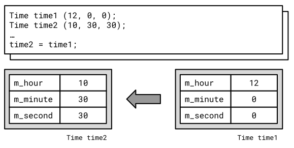
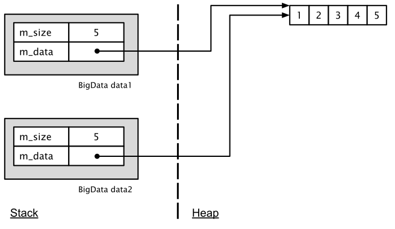
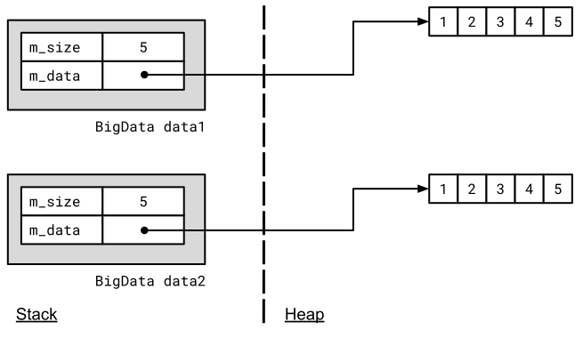

# &ldquo;Rule of Three&rdquo;:<br />Kopierkonstruktor, Wertzuweisungsoperator und Destruktor


[Zurück](Agenda.md)

---

## Erläuterungen

### Objekte mit dynamischen Daten

Betrachten wir folgendes einfache Beispiel einer Klasse `BigData` mit folgender Definition:

```cpp
01: class BigData
02: {
03: private:
04:     // private member data
05:     int m_size;   // current number of elements
06:     int* m_data;  // dynamically allocated array of elements
07: 
08: public:
09:     // c'tors
10:     BigData();
11:     BigData(int size);
12: };
```

Objekte von `BigData` sollen &ndash; dynamisch &ndash; einen Datenbereich verwalten.
Die Länge dieses Datenbereichs ist bei der Objekterzeugung dem Konstruktor im Parameter `size` zu übergeben
(siehe Zeile 11 des letzten Code-Fragments). Eine mögliche Realisierung des Konstruktors könnte so aussehen:


```cpp
01: BigData::BigData(int size) {
02: 
03:     // create buffer
04:     m_size = size;
05:     m_data = new int[m_size];
06: 
07:     // initialize buffer
08:     for (int i = 0; i < m_size; ++i) {
09:         m_data[i] = 0;
10:     }
11: }
```

Wesentlich ist Zeile 5: Hier wird dynamisch ein Stück Speicher auf der Halde mit dem `new`-Operator angelegt.

Nun betrachten wir ein extrem kurzes Anwendungsbeispiel mit einem `BigData`-Objekt:

```cpp
01: void test() {
02:     BigData data(100);
03: }
```

So kurz dieses Beispiel auch sein mag: Es ist falsch! Erkennen Sie den Fehler?

### Ein Destruktor zum automatisierten Freigeben von allokierten Speicher

Wenn im Konstruktor &ndash; oder auch in einer der Methoden der `BigData`-Klasse &ndash; `new` aufgerufen wird,
dann muss zwingend an anderer Stelle ein Aufruf von `delete` vorhanden sein.
Andernfalls generieren wir mit `BigData`-Objekten Speicherlücken (*memory leaks*)!

Eine Vorgehensweise wäre eine Methode `release`, die wir der Klasse `BigData` hinzufügen müssten
und die wir am Ende eines Lebensabschnitts von `BigData`-Objekten aufrufen müssten:

```cpp
01: void test() {
02:     BigData data(100);
03:     data.release();
04: }
```

Natürlich müsste in der Realisierung von `release` der entsprechende `delete`-Aufruf vorhanden sein:

```cpp
01: BigData::release() {
02:     delete[] m_data;
03: }
```

So etwas Ähniches gibt es auch in C++,
nur mit 2 Unterschieden:

  * Die Methode `release` heißt in C++ Destruktor, ihr Name ist identisch mit dem Klassennamen
    und einem vorangestellten Tilde-Symbol ('`~`')
  * Ein Aufruf des Destruktors wird vom Compiler am Ende eines Blocks, der `BigData`-Objekte enthält,
    automatisch abgesetzt. Wir rufen den Destruktor also nicht explizit auf, er wird implizit aufgerufen.

Korrekte Realisierung eines Destruktor der `BigData`-Klasse:

*Header-Datei*:

```cpp
~BigData();
```

*Implementierungs-Datei*:

```cpp
01: BigData::~BigData() {
02:     delete[] m_data;
03: }
```

### Objekte kopieren und zuweisen

Wann immer in C++ ein Objekt kopiert wird, ist daran entweder ein Kopierkonstruktor
oder ein Zuweisungsoperator beteiligt.

Der *Zuweisungsoperator* wird ausgeführt, wenn wir eine Wertzuweisung zweier Objekte tätigen:

```cpp
01: Time t1;
02: Time t2;
03: // ...     
04: t1 = t2;
```

Der *Kopierkonstruktor* ist ein Konstruktor,
der als Argument ein anderes Objekt seiner Klasse übergeben bekommt.

Er kommt &ndash; unter anderem &ndash; zum Zuge,
wenn er direkt zur Erzeugung eines Objekts aufgerufen wird:

```cpp
01: Time t1;
02: // ...
03: Time t2 (t1);
```

Das interessante an diesen beiden Anweisungen (Wertzuweisung und Objekterzeugung) ist,
dass wir hierzu keinerlei Untertützung leisten müssen.

C++ stellt hierzu Standardversionen eines Kopierkonstruktors und eines Zuweisungsoperators zur Verfügung,
die bei Bedarf aufgerufen werden.

### *Flat Copy* versus *Deep Copy*

Die Standardversionen des Kopierkonstruktors und Zuweisungsoperators
kopieren die beteiligten Objekte, indem sie einfach die Inhalte der einzelnen Instanzvariablen
1:1 von Objekt *A* in das Objekt *B* kopieren.
Man bezeichnet diese Vorgehensweise auch als *flaches* Kopieren (engl. *flat copy* oder auch *shallow copy*).



*Abbildung* 1: Erstellung einer flachen Kopie.

Die Standardversionen für das Kopieren und Zuweisen sind völlig ausreichend,
wenn in den Instanzvariablen der beteiligten Objekte **keine** Zeigervariablen vorhanden sind.

Worin besteht das Problem, wenn Objekte Zeiger als Instanzvariablen haben?

Betrachten wir zu diesem Beispiel eine Klasse `BigData` mit folgender Definition:

```cpp
01: class BigData
02: {
03: private:
04:     // private member data
05:     int m_size;   // current number of elements
06:     int* m_data;  // dynamically allocated array of elements
07: 
08: public:
09:     // c'tors
10:     BigData();
11:     BigData(int size);
12: };
```

Objekte von `BigData` sollen &ndash; dynamisch &ndash; einen Datenbereich verwalten.
Die Länge dieses Datenbereichs ist bei der Objekterzeugung dem Konstruktor im Parameter `size` zu übergeben
(siehe Zeile 11 des letzten Code-Fragments).

Betrachten Sie nun *Abbildung* 2 genau. Sie visualisiert eine Zuweisung zweier `BigData`-Objekte
an Hand der Strategie des *flachen* Kopierens. Worin besteht das Problem?



*Abbildung* 2: Fehlerhafte Erstellung eines Objekts mit dynamisch allokierten Daten.


Eine korrekte Realisierung derartiger Klassen erreichen Sie nur,
indem Sie sowohl für den Kopierkonstruktor als auch den Zuweisungsoperator
eine Implementierung (Überladung) bereitstellen, die so implementiert wird,
dass für jeden Zeiger ein eigener Speicherbereich mít `new` allokiert wird und anschließend der Inhalt,
auf den der ursprüngliche Zeiger verweist, umkopiert wird.

Man bezeichnet dies als das so geannte *tiefe* Kopieren (engl. *deep copy*),
siehe dazu auch *Abbildung* 3:



*Abbildung* 3: Korrekte Erstellung eines Objekts mit dynamisch allokierten Daten.

### Überladen von Kopierkonstruktor und Wertzuweisungsoperator

Die notwendige Realisierung für ein korrektes Kopieren zweier Objekte,
so wie in *Abbildung* 3 dargestellt, entnehmen Sie bitte dem folgenden Quellcode.

### Die &ldquo;Rule of Three&rdquo;

Die viel zierter &ldquo;Rule of Three&rdquo; &ndash; in manchen Büchern auch als &ldquo;Big-Three&rdquo; bezeichnet &ndash; 
besagt nun einfach, dass jede C++&ndash;Klasse, die dynamische Daten allokiert, zwingend

  * einen Destruktor,
  * einen Kopierkonstruktor und
  * einen Wertzuweisungsoperator

besitzen bzw. überladen muss!


## Beispiele

Datei *BigData.h*:

```cpp
01: class BigData
02: {
03: private:
04:     // private member data
05:     int m_size;   // current number of elements
06:     int* m_data;  // dynamically allocated array of elements
07: 
08: public:
09:     // c'tors and d'tor
10:     BigData();
11:     BigData(int size);
12:     ~BigData();
13: 
14:     // getter
15:     int size() const;
16:     bool isEmpty() const;
17: 
18:     // copy semantics
19:     BigData(const BigData&);              // copy c'tor
20:     BigData& operator= (const BigData&);  // copy assignment
21: 
22:     // public interface
23:     void print();
24: };
```

Datei *BigData.cpp*:

```cpp
01: // c'tors and d'tor
02: BigData::BigData() {
03: 
04:     // empty buffer
05:     m_size = 0;
06:     m_data = nullptr;
07: }
08: 
09: BigData::BigData(int size) {
10: 
11:     // create buffer
12:     m_size = size;
13:     m_data = new int[m_size];
14: 
15:     // initialize buffer
16:     for (int i = 0; i < m_size; ++i) {
17:         m_data[i] = 0;
18:     }
19: }
20: 
21: BigData::~BigData() {
22:     delete[] m_data;
23: }
24: 
25: // copy semantics: copy constructor and assignment operator 
26: BigData::BigData(const BigData& data) {
27: 
28:     // allocate buffer
29:     m_size = data.m_size;
30:     m_data = new int[m_size];
31: 
32:     // copy object
33:     for (int i = 0; i < m_size; ++i) {
34:         m_data[i] = data.m_data[i];
35:     }
36: }
37: 
38: BigData& BigData::operator= (const BigData& data) {
39: 
40:     // prevent self-assignment
41:     if (this == &data)
42:         return *this;
43: 
44:     // delete old buffer
45:     delete[] m_data;
46: 
47:     // allocate a new buffer
48:     m_size = data.m_size;
49:     m_data = new int[m_size];
50: 
51:     // copy buffer
52:     for (int i = 0; i < m_size; ++i) {
53:         m_data[i] = data.m_data[i];
54:     }
55: 
56:     return *this;
57: }
58: 
```


---

#### Datei *Main.cpp* - Testrahmen:


```cpp
01: void testRuleOfThree02() {
02: 
03:     BigData data1(100);
04:     BigData data2;
05:     data2 = data1;
06: }
```

---

## Quellcode des Beispiels:

[BigData.h](..\RuleOfThree\BigData.h)<br />
[BigData.cpp](..\RuleOfThree\BigData.cpp)<br />
[Main.cpp](..\RuleOfThree\Main.cpp)

---


## Übungen

TBD: Rectangle


---


[Zurück](Agenda.md)

---
