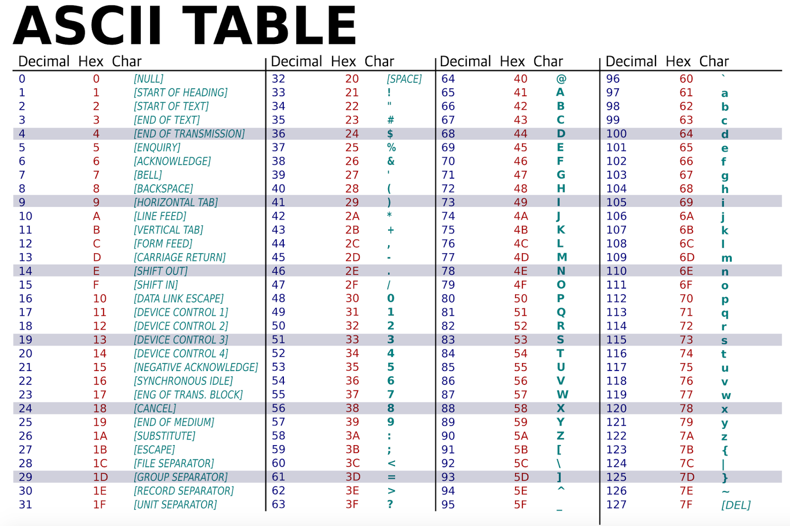

# Zeichenketten: Klasse `std::string`


[Zurück](Agenda.md)

---

## Erläuterungen

### Zeichen

Zeichen werden in C und C++ auf den Datentyp `char` abgebildet:

#### Datei [*Main.cpp*](../Strings/Main.cpp):

```cpp
01: void testChar()
02: {
03:     char ch;
04:     int n;
05: 
06:     ch = '*';
07:     std::cout << ch << std::endl;
08: 
09:     n = ch;
10:     std::cout << n << std::endl;
11: 
12:     ch = 65;     // ASCII table: 'A'
13:     std::cout << ch << std::endl;
14: 
15:     // printing ASCII table
16:     for (int i = 0; i <= 127; i++) {
17: 
18:         std::cout << i << ": " << (char) i << std::endl;
19:     }
20: 
21:     char digit('1');
22:     bool b1 = std::isdigit(digit);
23: 
24:     char noDigit('!');
25:     bool b2 = std::isdigit(noDigit);
26: }
```

*Ausführung*:

```
*
42
A
```

Man beachte in dem Beispiel den Zusammenhang der beiden Datentypen `char` und `int`,
siehe dazu auch die ASCII-Tabelle:



*Abbildung* 1: Die ASCII_Tabelle.

ASCII steht für *American Standard Code for Information Interchange*.
Die Zeichen 0 bis 127 wurden schon vor langer Zeit festgelegt, als der ASCII-Code noch ein 7 Bit-Code
war. Später hat IBM einen erweiterten ASCII-Code mit 8 Bit eingeführt, der zusätzlich die Zeichen 128 bis
255 umfasst.


### Zeichenketten

Zeichenketten werden in der Programmiersprache C auf den Datentyp `const char*` abgebildet.
Es stehen in C auch Funktionen für Verkettung, Vergleich, Kopie usw. zur Verfügung,
diese sind in ihrem Gebrauch jedoch nicht sehr einfach bzw. intuitiv.

Einem C++&ndash;Entwickler steht aus der C++ Standardbibliothek
(*Standard Template Library*, *STL*) die Klasse `std::string` zur Verfügung.
Sie ist in der Hantierung erheblich einfacher als das Arbeiten mit Variablen des Typs `const char*`.

### Einbinden der Klasse `std::string` aus der C++&ndash;Standardbibliothek

Zur Benutzung der Klasse `std::string` muss ein entsprechendes STL-Headerfile eingebunden werden:

```cpp
#include <string>
```

Durch diese Anweisung wird die Klasse `string` aus dem Namensraum `std` bekannt gemacht,
so daß für die korrekte Verwendung `std::string` verwendet werden muss.

Das folgende Beispiel versucht, einige der bisher betrachteten objektorientierten Techniken
an einer C++ Standardklasse zu demonstrieren bzw. zu beobachten:

  * Konstruktoren
  * *getter*/*setter*
  * Methode
  * Operatoren
  * Ausgabe (Operator `<<`)


### Die Klasse `std::string` exemplarisch betrachtet

#### Datei [*Main.cpp*](../Strings/Main.cpp):


```cpp
01: void testString()
02: {
03:     // standard class 'std::string'
04: 
05:     // constructor
06:     std::string s("12345");
07: 
08:     // operator <<
09:     std::cout << s << std::endl;
10: 
11:     // getter: size
12:     size_t len = s.size();
13:     std::cout << "Length: " << len << std::endl;
14: 
15:     // getter: empty
16:     bool b = s.empty();
17:     std::cout << "Empty: " << std::boolalpha << b << std::endl;
18: 
19:     // method: insert
20:     // insert "ABC" at position 2
21:     s.insert(2, "ABC");
22:     std::cout << "s.insert(2, \"ABC\") ==> " << s << std::endl;
23: 
24:     // method: append
25:     // append "!!!"
26:     s.append("!!!");
27:     std::cout << "s.append(\"!!!\")    ==> " << s << std::endl;
28: 
29:     // comparison operators
30:     std::string s1("12345");
31:     std::string s2("12345");
32:     std::string s3("123456");
33: 
34:     bool b1 = (s1 == s2);
35:     bool b2 = (s1 == s3);
36: 
37:     std::cout << "s1 == s2           ==> " << std::boolalpha << b1 << std::endl;
38:     std::cout << "s1 == s3           ==> " << std::boolalpha << b2 << std::endl;
39: 
40:     // method: substr - retrieve a substring
41:     // first param = position of the first character to include
42:     // second param = length of the substring
43:     std::string sub = s1.substr(1, 3);
44:     std::cout << "s1.substr(1, 3)    ==> " << std::boolalpha << sub << std::endl;
45:         
46:     // index operator []
47:     s[2] = '?';
48:     std::cout << "s[2] = '?'         ==> " << s << std::endl;
49: 
50:     // method: append
51:     // append another std::string object
52:     std::string result;
53:     result = s1.append(s2);
54:     std::cout << "s1.append(s2)      ==> " << result << std::endl;
55: 
56:     // operator +
57:     // concatenating two strings (same as using method append)
58:     result = s1 + s3;
59:     std::cout << "s1 + s3            ==> " << result << std::endl;
60: 
61:     // converting a string to an integer
62:     std::string number("123");
63:     int value = std::stoi(number);
64:     std::cout << "std::stoi(\"123\")   ==> " << value << std::endl;
65: }
```

*Ausgabe*:

```
12345
Length: 5
Empty: false
s.insert(2, "ABC") ==> 12ABC345
s.append("!!!")    ==> 12ABC345!!!
s1 == s2           ==> true
s1 == s3           ==> false
s1.substr(1, 3)    ==> 234
s[2] = '?'         ==> 12?BC345!!!
s1.append(s2)      ==> 1234512345
s1 + s3            ==> 1234512345123456
std::stoi("123")   ==> 123
```


*Bemerkung*:
Welche Unterschiede erkennen Sie in der Schreibweise des Beispiel im Gegensatz
zu den von mir verwendeten Beispielen?

*Antwort*:
Die *getter*-Methoden halten sich nicht an die Konvention, den Methodennamen mit `get` einzuleiten.

An Stelle der erwarteten Methodenbezeichner

  * `getLength` bzw. `getSize` 
  * `isEmpty`
  * `getCapacity`

haben sich die Bibliotheksentwickler für die Bezeichner


  * `length` bzw. `size` 
  * `empty`
  * `capacity`

entschieden.

---

## Quellcode des Beispiels:

[*Main.cpp*](../Strings/Main.cpp)

---

## Aufgaben

[Aufgabe zur Klasse `std::string`](../Exercises/Exercises_Strings.md)

---

[Zurück](Agenda.md)

---
