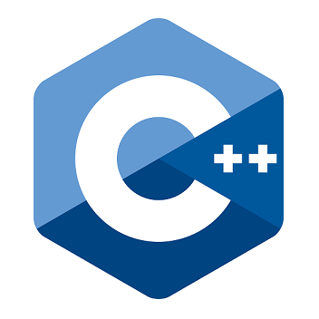

# Einführung in die Programmiersprache C++

  

## [Vorab](./Cpp_Introduction/Markdown/FirstOfAll.md)

## [Einleitung](./Cpp_Introduction/Markdown/Introduction.md)

## [Historisches zu C++](./Cpp_Introduction/Markdown/History.md)

## [Agenda](./Cpp_Introduction/Markdown/Agenda.md)

## [Fahrplan](./Cpp_Introduction/Markdown/Roadmap.md)

## [Aufgaben](./Cpp_Introduction/Exercises/Exercises.md)

## [Literatur](./Cpp_Introduction/Markdown/Literature.md)

## [Technische Hinweise](./Cpp_Introduction/Markdown/HowToInstall.md)

<!--
## [To be Done](./Cpp_Introduction/Markdown/ToBeDone.md)
-->

